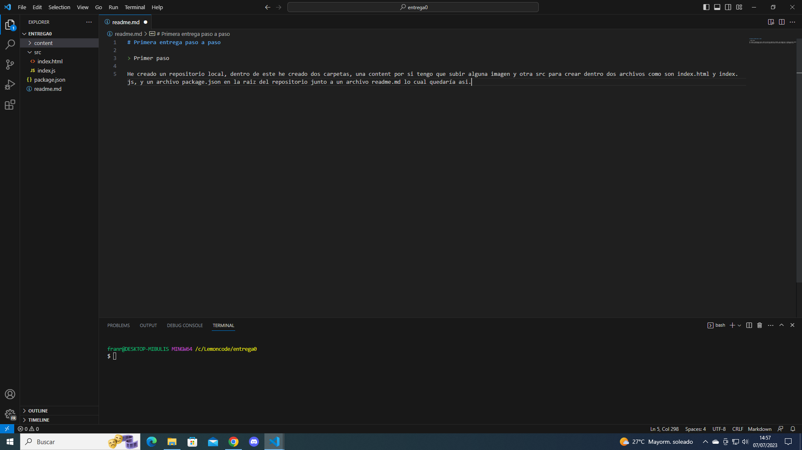
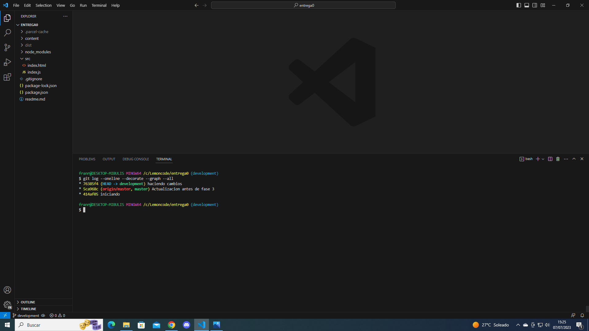

# Primera entrega paso a paso

> Primer paso

He creado un repositorio local, dentro de este he creado dos carpetas, una content por si tengo que subir alguna imagen y otra src para crear dentro dos archivos como son index.html y index.js, y un archivo package.json en la raiz del repositorio junto a un archivo readme.md lo cual quedaría asi.

> Segundo paso

Despues de hacer la instalacion y darle a comenzar, vamos a subirlo a GitHub. Comienzo con un git init. Como hay archivos temporales que no queremos que se suba creamos un archivo. gitignore. hacemos un git add y despues un commit. Despues con un git remote add origin (url) y un git push --set-upstream origin master para subirlo a Gibhud.

> Tercer paso

Creamos una nueva rama llamada "development" y cambiamos a esta rama, hacemos algun cambio en uno de los archivos, y lo subimos a github

>Nos cambiamos a la rama development y añadimos contenido al archivo readme.md y guardamos los cambios en gibhud